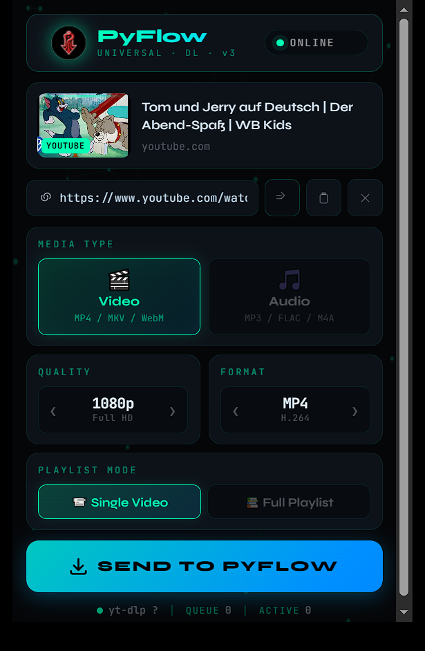
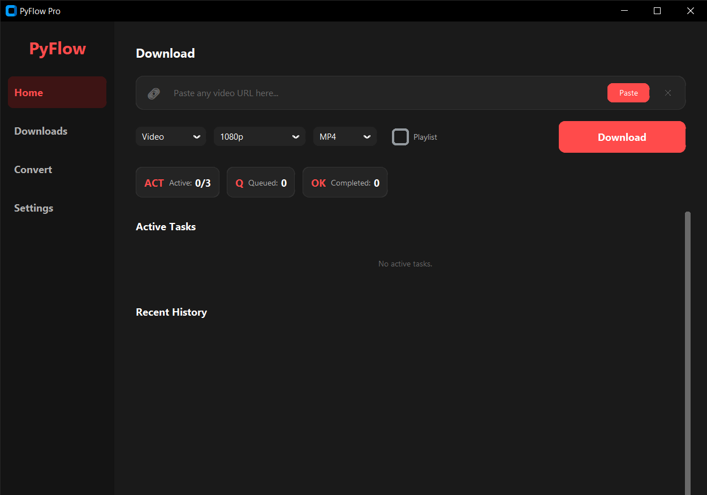

# PyFlow - Modern 1000+ Site Video/Audio Downloader

A professional 1000+ site support YouTube downloader consisting of a Chrome Extension frontend and
a Python GUI & CLI backend powered by `yt-dlp` and `ffmpeg`. pyFlow is designed for simplicity, speed, and reliability with a sleek modern UI.

---
<p align="center">
  
</p>

## 🌟 Features

### Chrome Extension

- **1000+ site support** — detects video/audio on every yt-dlp-supported site
- **Biopunk Neural HUD** — animated particle canvas, bioluminescent UI, 2035-style design
- **Arrow dial selectors** — quality and format browsed with ◀ ▶ without dropdowns
- **Universal URL detection** — og:video, HTML5 `<video>`, `<audio>` og:image fallbacks
- **Animated server status** — pulsing dot with auto-refresh every 8 seconds
- **Modern Dark UI** with glassmorphism design
- **Smart URL Detection** - Automatically detects YouTube videos and playlists
- **Real-time Server Status** - Shows if Python CLI is running
- **Video Preview** - Shows thumbnail and title before downloading
- **Flexible Options**:
  - Download single video or entire playlist
  - Video or audio-only downloads
  - Multiple quality options (4K, 1080p, 720p, 480p, 360p)
  - Multiple format options (MP4, MKV, WebM, MP3, M4A, OPUS, FLAC)
- **In-page Download Button** - Injected directly into YouTube's interface
- **Cross-origin Communication** - Seamless messaging between extension and Python GUI & CLI server
- **Error Handling** - User-friendly error messages for common issues

### Server Backend

- **yt-dlp Integration** - The powerful YouTube downloader engine
- **FFmpeg Processing** - Automatic format conversion and audio extraction with FFmpeg
- **Async Queue System** - Non-blocking downloads with concurrent processing
- **Real-time UI** - Beautiful terminal dashboard using Rich library
- **Smart Processing** - ffmpeg conversion runs in parallel with downloads
- **Cross-platform** - Works on Windows, macOS, and Linux
- **RESTful API** - FastAPI server for extension communication
- **Progress Tracking** - Real-time download speed, progress, and ETA
- **Automatic Updates** - Background yt-dlp updates on startup
- **Configurable Settings** - Set default quality, format, and download type
- **Robust Error Handling** - Graceful handling of download failures and retries

## 📸 Visual Showcase

| 📱 Main Controller (Popup) | ⚙️ Advanced Settings |
| :---: | :---: |
|  |  |

---
## 📋 Prerequisites

### For Chrome Extension

- Google Chrome or Chromium-based browser (Edge, Brave, etc.)
- Chrome 88+ (Manifest V3 support)

### For Python CLI

- Python 3.10 or higher
- ffmpeg installed and in PATH
- pip (Python package manager)

## 🚀 Installation

### Step 1: Install Python CLI

Navigate to the Python CLI directory:

```bash
cd pyflow_server
```

Install Python dependencies

```bash
pip install -r requirements.txt
```

1. Install ffmpeg (if not already installed):

**Windows:**

- Download from [ffmpeg.org](https://ffmpeg.org/download.html)
- Extract and add to PATH

**macOS:**

```bash
brew install ffmpeg
```

**Linux:**

```bash
sudo apt install ffmpeg  # Ubuntu/Debian
sudo dnf install ffmpeg  # Fedora
```

### Step 2: Install Chrome Extension

1. Open Chrome and navigate to `chrome://extensions/`

2. Enable "Developer mode" (toggle in top-right corner)

3. Click "Load unpacked"

4. Select the `chrome-extension` folder

5. The PyFlow extension should now appear in your extensions list

### Windows Setup .exe Installer (Optional)

1. Download the latest PyFlow installer from the releases page
2. Unzip and run the installer
3. PyFlow will be installed and added to your PATH automatically
4. You can start the server by running `pyflow` in your terminal
5. The installer also includes an option to create a desktop shortcut for easy access
6. Extension installation is still required for browser integration, but the installer will guide you through the process

## 🚀 Running

## 📖 Usage

### Starting the PyFlow Server

1. Navigate to the Python CLI directory:

```bash
cd pyflow_server
```

2. Run the application:

python main.py
```bash
python main.py

python main.py --cli
```

windows exe installer users can simply run:

```bash
pyflow

pyflow --cli
```


3. You should see:

```text

🚀 PyFlow - YouTube Downloader CLI
==================================================
✅ Server started on http://localhost:8000
📦 Download directory: /Users/YourName/Downloads/PyFlow

💡 Open your browser and use the PyFlow extension!
==================================================
```

4.Help for server info

```
pyflow/server> pyflow -h
usage: pyflow [-h] [--hidden | --show | --stop | --status] [--path DIR] [--port PORT] [--host HOST] [--no-update] [--version]
              [--check]

PyFlow – YouTube Downloader Server

options:
  -h, --help          show this help message and exit
  --hidden            Run server in background. Terminal can be closed safely.
  --show              Run server with full live UI dashboard (default when no mode given).
  --stop              Stop a running background server and exit.
  --status            Check whether a PyFlow server is currently running.
  --path DIR, -p DIR  Set download directory. Saved for future runs.
  --port PORT         HTTP port (default: 8000)
  --host HOST         Bind address (default: 127.0.0.1)
  --no-update         Skip background yt-dlp auto-update on startup.
  --version, -v       show program's version number and exit
  --check             Check dependencies and exit.

PyFlow –- YouTube Downloader Server
════════════════════════════════════════════════════════════════════
```

### Using the Chrome Extension

**Method 1: Extension Popup**

1. Navigate to any YouTube video
2. Click the PyFlow extension icon in your toolbar
3. Configure quality, format, and download type
4. Click "Download"

**Method 2: In-page Button**

1. Navigate to any YouTube video
2. Look for the "PyFlow" button next to Like/Share buttons
3. Click it to open download options
4. Configure and download

### Downloading Playlists

1. Navigate to a YouTube video that's part of a playlist
2. Open the PyFlow extension
3. You'll see a "Download Mode" toggle
4. Choose "Whole Playlist" to download all videos
5. Configure quality and format
6. Click "Download"

## 🎨 Screenshots

### Extension Popup

```
┌─────────────────────────────────┐
│  ●  Server Online               │
│  YT-DLP Bridge                  │
├─────────────────────────────────┤
│  [Thumbnail] Video Title        │
├─────────────────────────────────┤
│  Type: [Video ▼]                │
│  Quality: [1080p ▼]             │
│  Format: [MP4 ▼]                │
│                                 │
│  [    Download    ]             │
└─────────────────────────────────┘
```

### Terminal UI

```
╭─────────────────────────────────────────────────────────── PyFlow Status ───────────────────────────────────────────────────────────╮
│                                                      PyFlow YouTube Downloader                                                      │
│                               Queued: 0  |  Active: 0  |  Done: 0  |  yt-dlp: v2026.02.21  |  17:30:39                              │
│                                                                                                                                     │
╰─────────────────────────────────────────────────────────────────────────────────────────────────────────────────────────────────────╯
⬇  Active Downloads
╭─────────────┬───────────────────────┬──────────┬───────────┬────────────────┬─────────────────────────────┬──────────────┬──────────╮
│ ID          │ Title                 │ Type     │ Quality   │ Status         │ Progress                    │ Speed        │ ETA      │
├─────────────┼───────────────────────┼──────────┼───────────┼────────────────┼─────────────────────────────┼──────────────┼──────────┤
│ -           │ No active downloads   │ -        │ -         │ -              │ -                           │ -            │ -        │
╰─────────────┴───────────────────────┴──────────┴───────────┴────────────────┴─────────────────────────────┴──────────────┴──────────╯


✔  Recently Completed
╭─────────────────────┬───────────────────────────────────────────────┬───────────────┬───────────────────────────┬───────────────────╮
│ ID                  │ Title                                         │ Type          │ Status                    │ File              │
├─────────────────────┼───────────────────────────────────────────────┼───────────────┼───────────────────────────┼───────────────────┤
│ -                   │ No completed downloads yet                    │ -             │ -                         │ -                 │
╰─────────────────────┴───────────────────────────────────────────────┴───────────────┴───────────────────────────┴───────────────────╯


╭─────────────────────────────────────────────────────────────────────────────────────────────────────────────────────────────────────╮
│ 📁 C:\Users\Mohammod Mizan\Downloads\PyFlowPro_Downloads   |   Press Ctrl+C to stop  |  pyflow --help for CLI options               │
╰─────────────────────────────────────────────────────────────────────────────────────────────────────────────────────────────────────
```

## ⚙️ Configuration

### Extension Settings

Settings are automatically saved:

- Default quality preference
- Default format preference
- Default download type

### Python CLI Settings

Edit these variables in `download_manager.py`:

- `max_concurrent_downloads`: Number of simultaneous downloads (default: 2)
- Download directory is automatically set to `~/Downloads/PyFlow`

## 🔧 Troubleshooting

### Extension shows "Server Offline"

- Make sure the Python CLI is running (`pyflow`)
- Check that it's running on port 8000
- Verify firewall isn't blocking localhost connections

### Downloads fail

- Check that ffmpeg is installed: `ffmpeg -version`
- Verify yt-dlp is installed: `yt-dlp --version`
- Check Python CLI terminal for error messages

### No download button on YouTube

- Refresh the YouTube page
- Check that the extension is enabled
- Try disabling and re-enabling the extension

### Format/Quality not available

- Not all videos have all quality/format combinations
- yt-dlp will automatically select the best available option
- Check the terminal output for details

## 🛠️ Development

### Chrome Extension Structure

### Python GUI & CLI Structure

## 📝 API Endpoints

### GET /health

Check server status

```json
{
  "status": "online",
  "queue_size": 2,
  "active_downloads": 1
}
```

### POST /add-download

Add download to queue

```json
{
  "url": "https://youtube.com/watch?v=...",
  "download_type": "video",
  "is_playlist": false,
  "quality": "1080p",
  "format": "mp4",
  "title": "Video Title"
}
```

### GET /queue

Get queue status and active downloads

### DELETE /cancel/{task_id}

Cancel a specific download

## 🤝 Contributing

Contributions are welcome! Please feel free to submit a Pull Request.

## 📄 License

This project is for educational purposes. Please respect YouTube's Terms of
Service and copyright laws.

## ⚠️ Disclaimer

This tool is for personal use only. The developers are not responsible for any
misuse of this software. Always respect content creators' rights and YouTube's
Terms of Service.

## 🙏 Credits

- [yt-dlp](https://github.com/yt-dlp/yt-dlp) - The amazing YouTube downloader
- [FFmpeg](https://ffmpeg.org/) - Media processing
- [FastAPI](https://fastapi.tiangolo.com/) - Modern Python web framework
- [Rich](https://github.com/Textualize/rich) - Beautiful terminal formatting

---

Made with ❤️ by PyFlow Team
